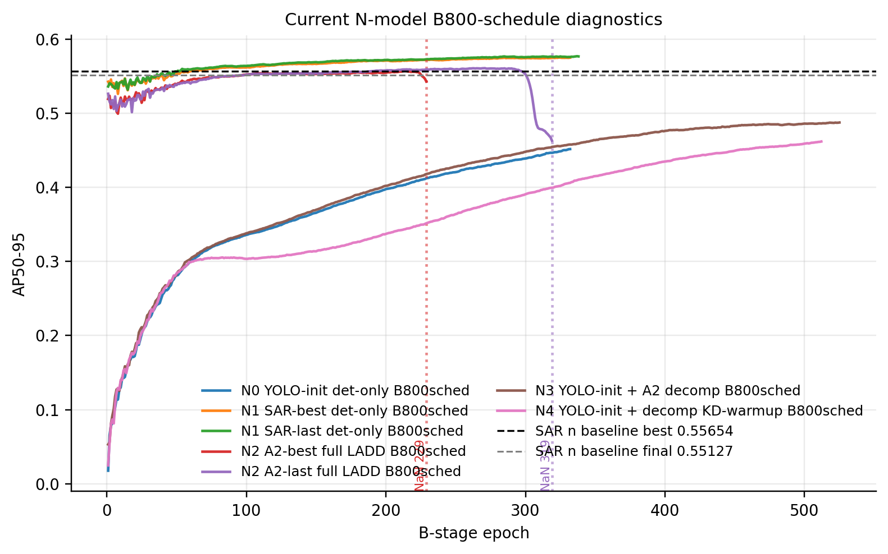
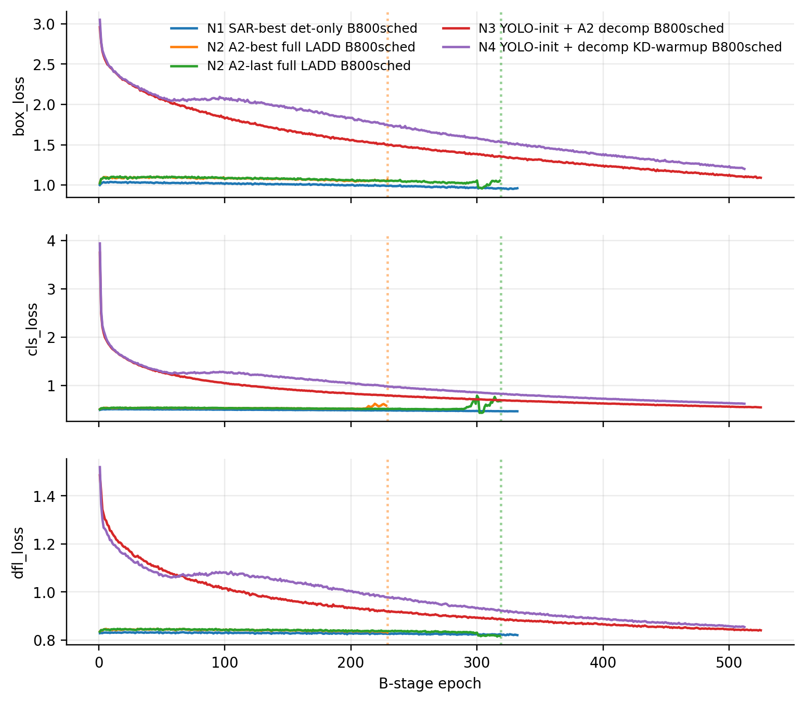
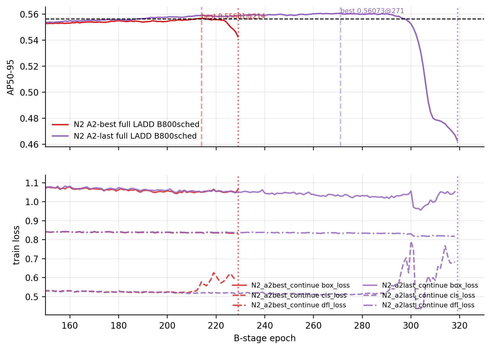
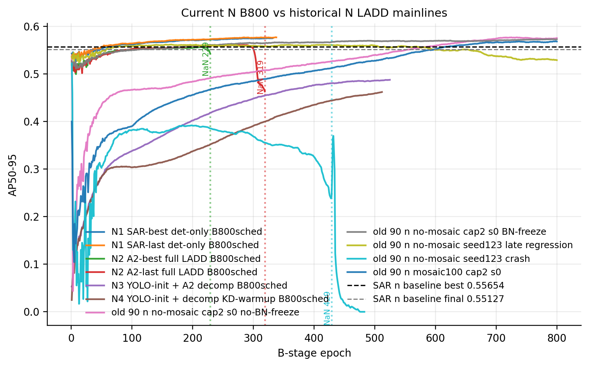
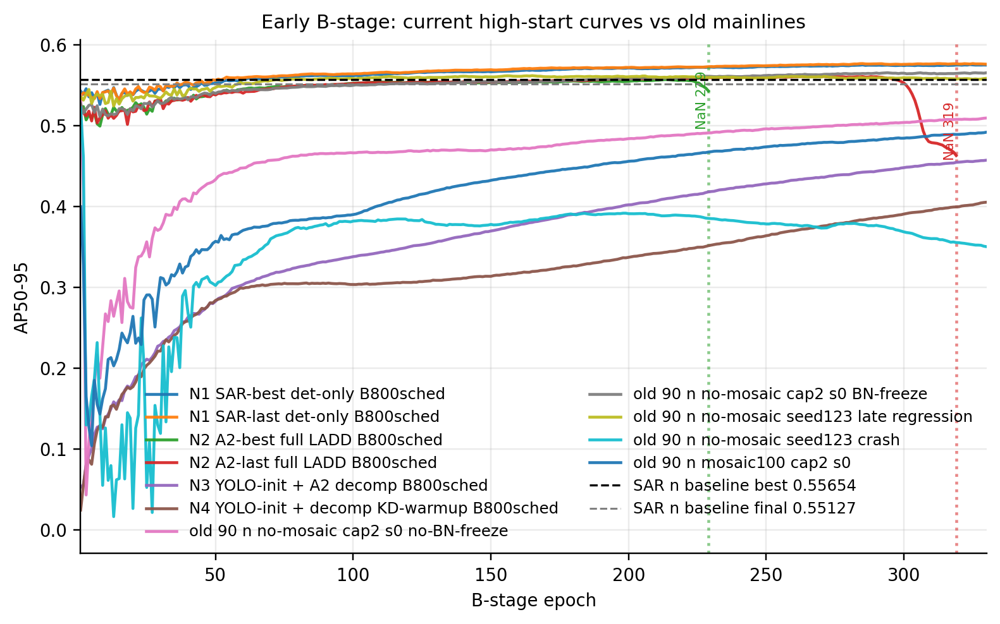
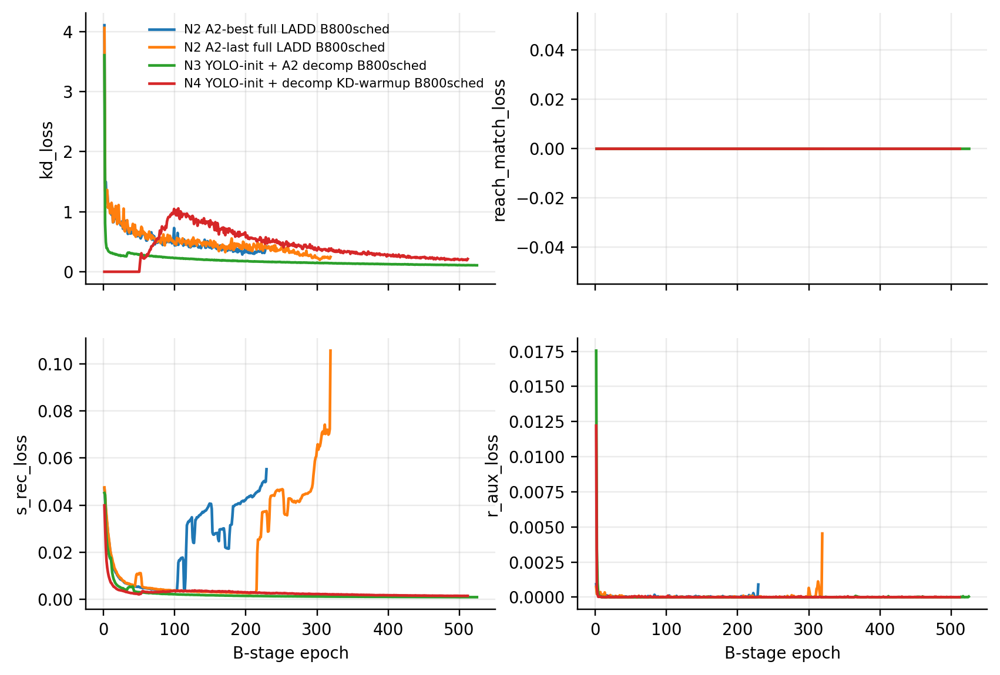
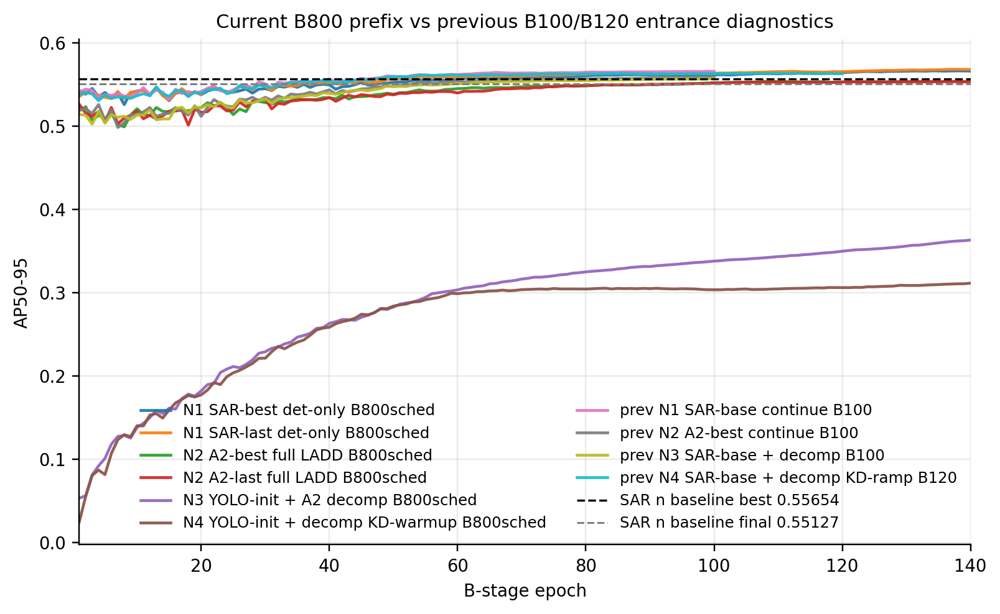
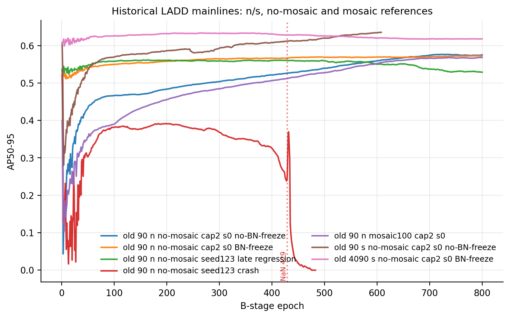

# LADD B800 重启批次曲线分析（2026-06-14）

本报告基于 2026-06-14 同步的轻量证据生成，只使用 `results.csv`、`ladd_diagnostics.csv`、`args.yaml`、`manifest.txt` 和 log extract；未复制或提交 checkpoint 权重、TensorBoard event、wandb 或完整 run 目录。

## 当前批次概览

| key                                          |   epochs_recorded |   best_ap |   best_epoch |   last_finite_ap |   last_finite_ap_epoch | first_nonfinite_epoch   | note                                                                  |
|:---------------------------------------------|------------------:|----------:|-------------:|-----------------:|-----------------------:|:------------------------|:----------------------------------------------------------------------|
| N0_yoloinit_detonly_B800sched                |               332 |   0.45155 |          332 |          0.45155 |                    332 |                         | YOLO initial detector; no LADD loss.                                  |
| N1_basebest_continue_B800sched               |               332 |   0.57521 |          324 |          0.57494 |                    332 |                         | SAR baseline best checkpoint continued with detection-only B.         |
| N1_baselast_continue_B800sched               |               338 |   0.57687 |          337 |          0.57661 |                    338 |                         | SAR baseline last checkpoint continued with detection-only B.         |
| N2_a2best_continue_B800sched                 |               229 |   0.55681 |          214 |          0.54271 |                    229 | 229.00000               | Continues from A2 best checkpoint; crashed after NaN recovery failed. |
| N2_a2last_continue_B800sched                 |               319 |   0.56073 |          271 |          0.4629  |                    319 | 319.00000               | Continues from A2 last checkpoint; crashed after NaN recovery failed. |
| N3_yoloinit_a2last_decomp_B800sched          |               525 |   0.48742 |          525 |          0.48742 |                    525 |                         | YOLO initial detector plus A2 decomposition split-load.               |
| N4_yoloinit_a2last_decomp_kdwarmup_B800sched |               512 |   0.4618  |          512 |          0.4618  |                    512 |                         | YOLO initial detector plus A2 decomposition and KD-only warmup.       |

## 异常定位

- `N2_a2best_continue_B800sched` 在 B epoch 229 记录到非有限训练 loss，best 为 `0.55681@214`，随后触发 NaN recovery。
- `N2_a2last_continue_B800sched` 在 B epoch 319 记录到非有限训练 loss，best 为 `0.56073@271`，随后触发 NaN recovery。
- 两条异常都不是 OOM。log 中的直接退出点是 NaN recovery 尝试从 `last.pt` 恢复时，在 Ultralytics recovery 路径里遇到 `Only Tensors created explicitly by the user (graph leaves) support the deepcopy protocol`。这说明“恢复机制”也有一个实现层面的失败点，但根因信号仍然是 B 阶段 loss 先变成 NaN/Inf。
- N1 det-only、N3/N4 在当前同步 epoch 内没有同类 NaN。这个对照使异常更像是“继承 A2 detector/full checkpoint 后进入 full LADD B 的数值稳定性问题”，而不是单纯 B800 schedule、BN freeze 或 YOLO-init split-load 必然导致。

异常 log 摘要：

- `ladd/results/b800_restart_20260614/summary/log_extracts/N2_a2best_continue_B800sched_anomaly_extract.txt`
- `ladd/results/b800_restart_20260614/summary/log_extracts/N2_a2last_continue_B800sched_anomaly_extract.txt`

## 图 1：当前 B800 AP 曲线

当前批次中，N1 baseline continuation 明显最强；N2 在 200-300 epoch 区间达到接近/略高于 SAR n baseline best 的点，但随后 NaN；N3/N4 从 YOLO 初始 detector 出发，曲线持续上升但截至同步点仍低于 N1/N2。

## 图 2：当前 detector loss 曲线

N2 的异常不是 AP 自然平台化，而是训练 loss 在中期进入非有限值。N1 det-only loss 更平稳，N3/N4 也没有在相同阶段爆掉。

## 图 3：N2 异常区间放大

放大后可以看到：N2 并不是从一开始崩，它先有一段正常上升并到达局部 best，之后才发生数值异常。这和“刚进 B 阶段被冲坏”不是同一种现象，更像中后段 full LADD objective 与继承 checkpoint 的组合出现不稳定。

## 图 4：当前 B800 与历史 n 主线 B800

历史 90 no-mosaic n 主线在 B800 后期仍能继续改善，best 通常出现在 700+ epoch；当前 N1 也显示 B800 schedule 不是短程 B100 能替代的。当前 N3/N4 的问题是起点和中期平台明显偏低，不能用 100 epoch 的表现直接代表 800 epoch 结论。

## 图 5：早期 B 阶段对比

最近实验的 B 起点较高，主要因为 N1/N2 使用的是已收敛 SAR/A2 detector checkpoint；mosaic100 历史曲线 B 起点低，是因为当时协议与进入 B 的状态不同，曲线呈现“先低后强爬升”。因此不能只凭 B 前 100 epoch 的平台程度判断 B800 的最终潜力。

## 图 6：当前 LADD loss 分量

N3/N4 的 decomposition/KD 分支没有导致明显 NaN；N2 的 NaN 更集中在继承 A2 full checkpoint 后的 full B 训练稳定性上。由于当前批次 `LADD_DIAG_LOG_GRAD=0`，还不能直接判断是否存在梯度尖峰；如果要继续定位，建议补一个短程 N2 复现实验打开 grad log。

## 图 7：当前 B800 前缀 vs 之前 B100/B120

这张图单独对齐前 140 epoch。之前 B100/B120 可以作为入口 smoke/短程趋势参考，但当前 B800 的学习率仍处于长程 schedule 的早期，不能把 B100 的末尾直接当成 B800 的稳定收敛结论。

## 图 8：历史 n/s LADD 主线

历史 no-mosaic n/s 都存在健康主线；这支持“当前异常不是 LADD 必然不收敛”，而是当前入口、checkpoint 组合、目标开启方式或数值防护需要继续定位。

## 历史参照表

| key                                 |   epochs_recorded |   best_ap |   best_epoch |   last_finite_ap |   last_finite_ap_epoch |   best_final_drop | note                                                              |
|:------------------------------------|------------------:|----------:|-------------:|-----------------:|-----------------------:|------------------:|:------------------------------------------------------------------|
| old_n_nomosaic_cap2_s0_no_bnfreeze  |               800 |   0.57662 |          725 |          0.57504 |                    800 |           0.00158 | Healthy 90 no-mosaic LADD mainline; best late.                    |
| old_n_nomosaic_cap2_s0_bnfreeze     |               800 |   0.57276 |          793 |          0.57254 |                    800 |           0.00022 | Healthy 90 no-mosaic LADD with BN freeze.                         |
| old_n_nomosaic_s123_late_regression |               800 |   0.56161 |          165 |          0.52875 |                    800 |           0.03286 | Historical late-regression case.                                  |
| old_n_nomosaic_s123_crash           |               483 |   0.52182 |            1 |          0       |                    483 |           0.52182 | Historical crash/collapse case.                                   |
| old_n_mosaic100_cap2_s0             |               800 |   0.56841 |          798 |          0.56792 |                    800 |           0.00049 | Mosaic-open historical mainline; starts low then climbs strongly. |
| old_s_nomosaic_cap2_s0_no_bnfreeze  |               608 |   0.63551 |          605 |          0.63527 |                    608 |           0.00024 | Historical s no-mosaic LADD mainline.                             |
| old_s_nomosaic_cap2_s0_bnfreeze     |               800 |   0.63388 |          263 |          0.61759 |                    800 |           0.01629 | Historical s BN-freeze LADD mainline.                             |

## 结论草案

1. 当前异常批次最关键的问题是 N2 在 B 中期出现 NaN，恢复逻辑失败只是第二层问题。
2. N1 det-only 在 B800 schedule 下持续向上，说明 B800 的学习率调度长度本身有价值，不能用 B100 平台直接否定长程训练。
3. N3/N4 从 YOLO-init 出发还在缓慢上升，但中期远低于 N1；这说明“只加载 A2 decomposition、detector 从 YOLO 初始化”目前不是高优先级主线候选，除非后期曲线发生很强反转。
4. 历史 no-mosaic n/s 主线证明 LADD 在 formal no-mosaic 下曾经可以健康收敛；当前需要重点排查 N2 的 full B 数值稳定性和 A2 checkpoint 入口差异。
