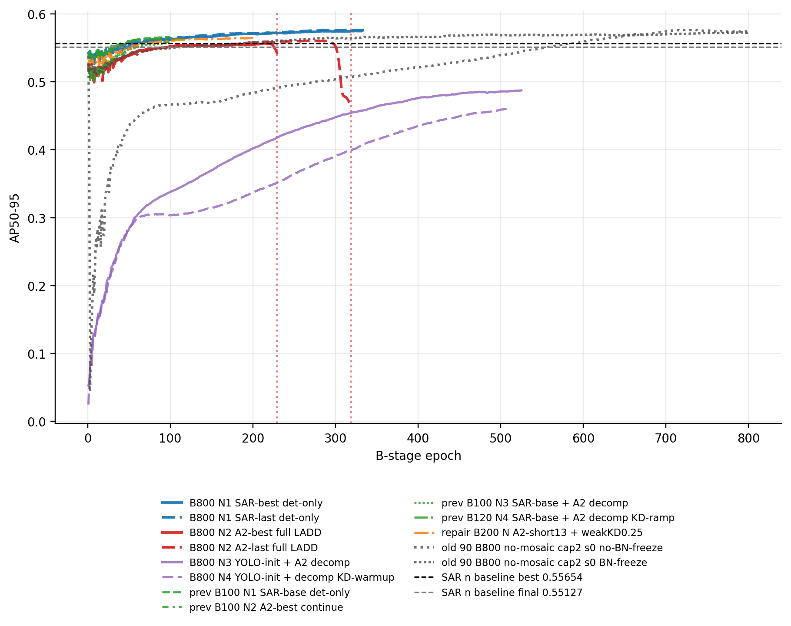
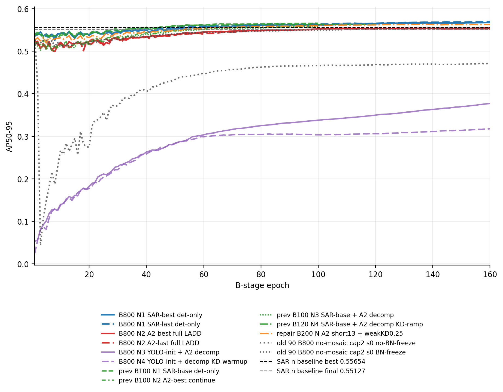
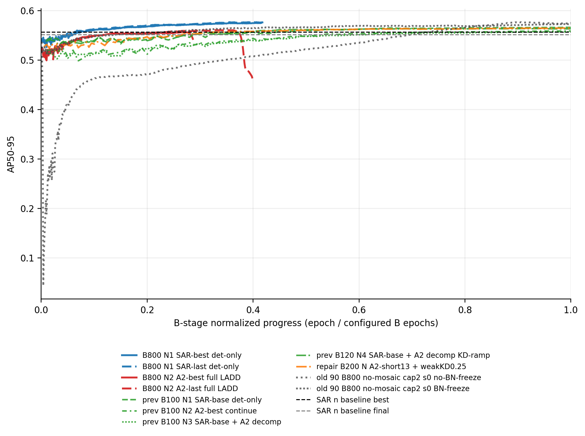
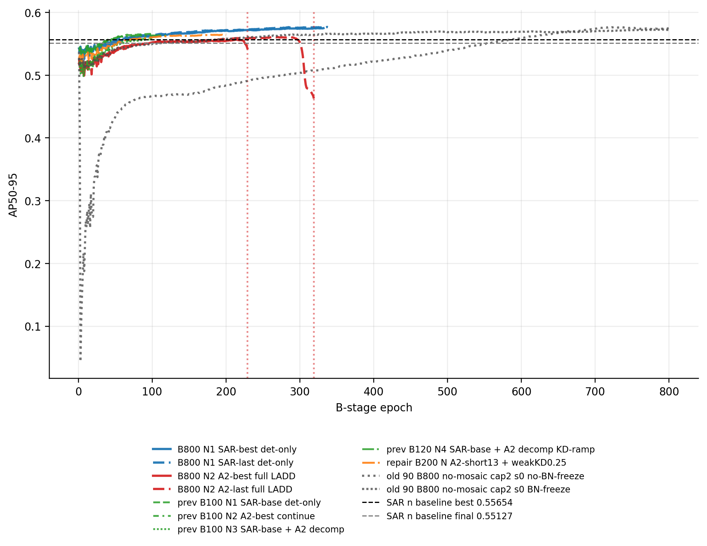
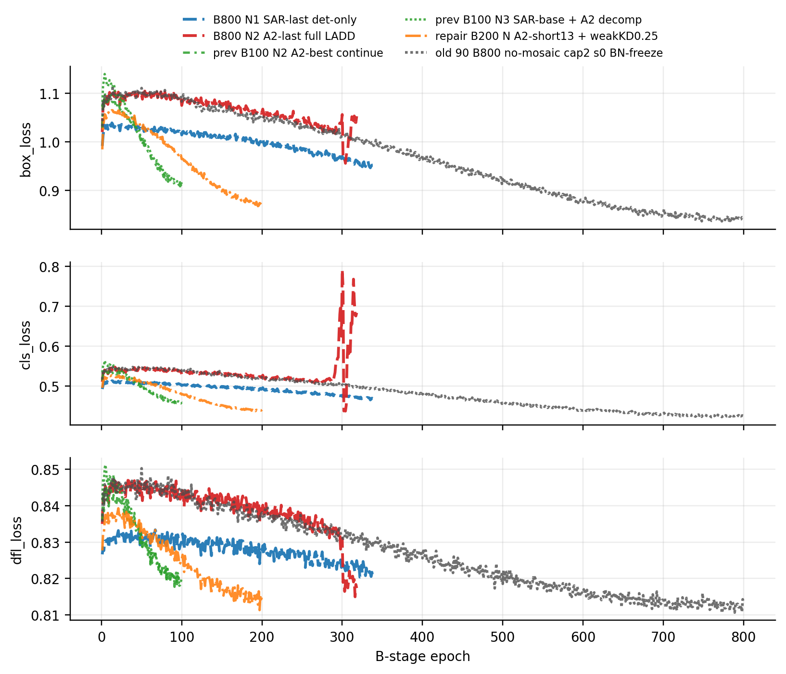

# LADD 当前 baseline 叠加曲线分析（2026-06-14）

本报告把当前 B800 重启批次、之前在当前 SAR baseline/A2 入口上做过的 LADD B 入口实验，以及 90 服务器 no-mosaic 健康主线叠加在一起。所有曲线都来自轻量 `results.csv`，未使用 checkpoint。

## 可比性说明

可以比较的部分：

- 数据集、模型容量、seed、formal no-mosaic 协议整体一致，n 模型曲线可以放在同一张图中观察。
- 当前 N2 A2-best/A2-last 和之前 N2 A2-best 的 B 起点完全一致或非常接近，说明入口语义是可对齐的。
- 90 服务器 no-mosaic B800 是重要参照：它说明同协议下 LADD 曾经能在 700+ epoch 继续涨。

需要谨慎的部分：

- B100/B120/B200 与 B800 的 cosine LR schedule 不同。它们能比较早期趋势，但不能把 B100 的 epoch 100 直接等价为 B800 的 epoch 100 或最终结论。
- 当前 N3/N4 已改成 YOLO-init detector + A2 decomposition；之前 N3/N4 是 SAR baseline detector + A2 decomposition。因此 N3/N4 新旧不是同一个入口，只能作为“入口改变”的对照。

## 汇总表

| key                                    | family                    |   b_epochs |   recorded_epochs |   best_ap |   best_epoch |   last_ap |   last_epoch_finite |   first_nonfinite_epoch |
|:---------------------------------------|:--------------------------|-----------:|------------------:|----------:|-------------:|----------:|--------------------:|------------------------:|
| current_N1_basebest_B800               | current_b800_det          |        800 |               332 |   0.57521 |          324 |   0.57494 |                 332 |                     nan |
| current_N1_baselast_B800               | current_b800_det          |        800 |               338 |   0.57687 |          337 |   0.57661 |                 338 |                     nan |
| current_N2_a2best_B800                 | current_b800_ladd         |        800 |               229 |   0.55681 |          214 |   0.54271 |                 229 |                     229 |
| current_N2_a2last_B800                 | current_b800_ladd         |        800 |               319 |   0.56073 |          271 |   0.4629  |                 319 |                     319 |
| current_N3_yoloinit_decomp_B800        | current_b800_yoloinit     |        800 |               525 |   0.48742 |          525 |   0.48742 |                 525 |                     nan |
| current_N4_yoloinit_decomp_kdwarm_B800 | current_b800_yoloinit     |        800 |               512 |   0.4618  |          512 |   0.4618  |                 512 |                     nan |
| prev_N1_base_B100                      | previous_current_baseline |        100 |               100 |   0.56615 |           99 |   0.56594 |                 100 |                     nan |
| prev_N2_a2best_B100                    | previous_current_baseline |        100 |               100 |   0.55872 |          100 |   0.55872 |                 100 |                     nan |
| prev_N3_base_decomp_B100               | previous_current_baseline |        100 |               100 |   0.55722 |          100 |   0.55722 |                 100 |                     nan |
| prev_N4_base_decomp_kdramp_B120        | previous_current_baseline |        120 |               120 |   0.56379 |          113 |   0.56311 |                 120 |                     nan |
| repair_N_weakkd025_B200                | repair_current_baseline   |        200 |               200 |   0.56476 |          197 |   0.56419 |                 200 |                     nan |
| old90_nomosaic_cap2_s0_noBN_B800       | old_same_protocol         |        800 |               800 |   0.57662 |          725 |   0.57504 |                 800 |                     nan |
| old90_nomosaic_cap2_s0_BNfreeze_B800   | old_same_protocol         |        800 |               800 |   0.57276 |          793 |   0.57254 |                 800 |                     nan |

## 图 1：当前 B800 + 之前 current-baseline LADD + 90 健康主线

这张图说明：当前 N1 det-only 已经非常接近/超过历史健康主线的中期区间；当前 N2 能到 baseline best 附近但会 NaN；之前 B100/B120 的 current-baseline LADD 在短程内看起来不差，但因为 schedule 短，不能代替 B800 长程判断。

## 图 2：前 160 epoch 放大

早期曲线可以看出，之前 current-baseline LADD 与当前 B800 前缀在 50-120 epoch 区间确实具有趋势可比性；但当前 B800 的 LR 下降更慢，所以后续仍有空间。

## 图 3：归一化进度轴

归一化后，B100/B120/B200 的“末尾”其实对应完整 schedule 的末段，而 B800 当前只跑到约 40%-65%。这解释了为什么短程实验看起来更快平台：它们在 schedule 语义上已经走到后段。

## 图 4：只看 current-baseline / A2 入口，不混入 YOLO-init N3/N4

不看 YOLO-init 后，核心矛盾更清楚：det-only baseline continuation 很强；full LADD A2 入口有收益苗头但数值不稳定；历史健康主线说明长程 full LADD 本来可以冲到更高，因此下一步更该定位当前 full B 的稳定性和入口差异，而不是简单否定 LADD。

## 图 5：detector loss 对比

N2 A2-last 的 loss 在 NaN 前明显出现 cls loss 抬升；det-only 和历史健康主线更平稳。这个图支持“异常不是普通平台，而是 full LADD B 数值/优化稳定性问题”。

## 结论

1. 你的理解基本对：formal no-mosaic 协议没有变，所以 n 模型主线曲线有可比性。
2. 但 B100/B120/B200 和 B800 的 schedule 不同，所以更适合比较“入口趋势”，不适合比较最终能力。
3. 当前最强的安全结果仍是 N1 SAR-last det-only B800 前缀，best `0.57687@337`；它已经接近/超过历史 no-mosaic cap2 健康主线的最终量级。
4. full LADD 的 N2 不是完全没信号：A2-last B800 到过 `0.56073@271`，但随后 NaN；如果能解决稳定性，它仍可能有空间。
5. 新 N3/N4 从 YOLO-init 出发，不应和旧 N3/N4 直接当成同一实验；目前它们主要说明“detector 从 YOLO init 开始太慢/偏弱”。
