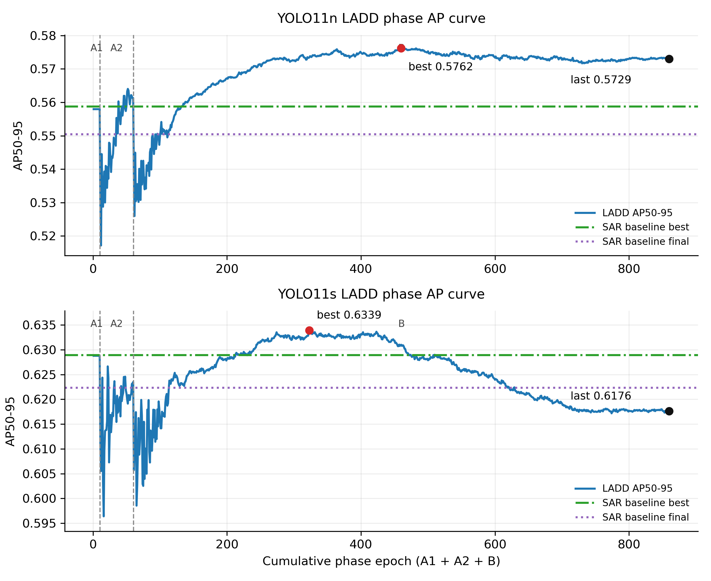
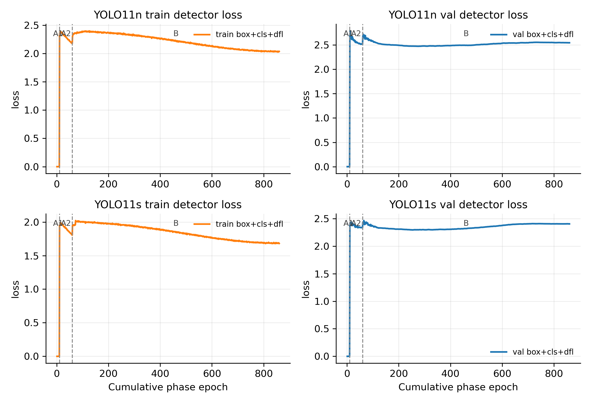
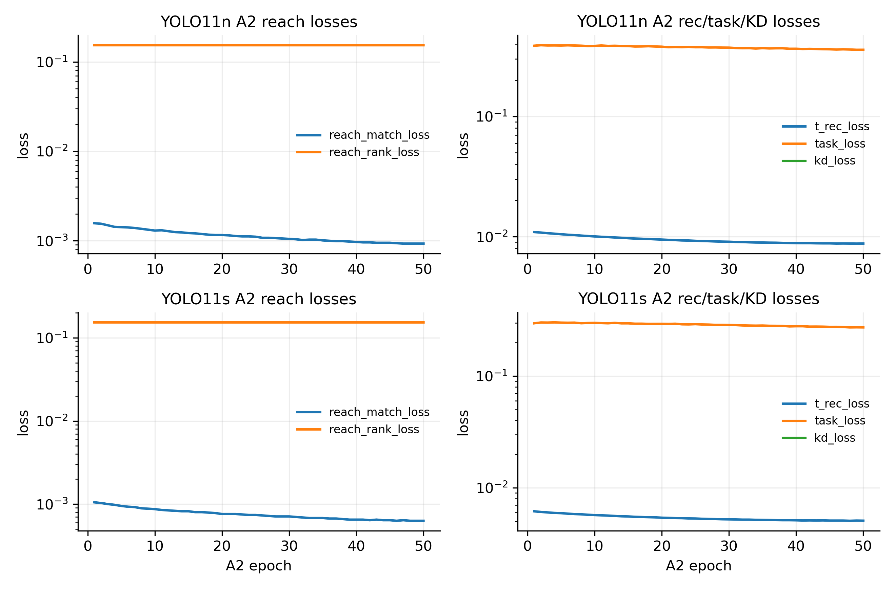
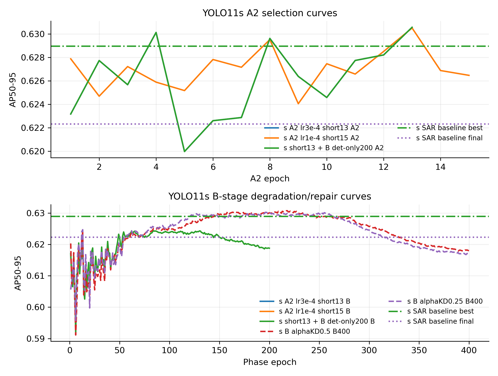

# LADD n/s 曲线诊断图 2026-06-12

本页汇总 YOLO11n / YOLO11s LADD 分阶段曲线，用于解释 A2 损伤、B 阶段 late regression，以及 reach/rec 等辅助损失是否本身收敛。

## 图件

## 读图要点

1. YOLO11n 的 stabilized BN-freeze 主线在 B 阶段 best 与 final 都保持在 SAR baseline 上方，说明 n 容量下方法主线有正向证据。
2. YOLO11s 的 B 阶段出现明显 best-final gap：best 高于 SAR baseline，但 final 掉到 SAR baseline final 下方，属于 late regression 而不是单纯没有学到。
3. YOLO11s A2 full50 在早期达到较好点后回落；short13/lr3e-4 能把 A2 final 锁在峰值附近，是当前更干净的 A2 起点。
4. A2 reach_match 通常快速降到很小，reach_rank 维持在约 0.15 附近；rec/task/KD 曲线并没有爆炸，说明当前主要异常更像 detector performance drift / B-stage regression，而不是 reach/rec 不收敛。
5. s 的 B det-only/alphaKD 曲线显示：进入 B 后即使 detector-only 或弱 KD，仍可能低于 A2 best；因此汇报时需要把 A2 peak 与 B best/final 分开讲。

## 数值摘要

| run                       | model   | phase   |   epochs |   best_epoch |   best_map |   last_epoch |   last_map |   best_final_drop |   last_train_det_total |   last_val_det_total | path                                                                                                                                                                                                           |
|:--------------------------|:--------|:--------|---------:|-------------:|-----------:|-------------:|-----------:|------------------:|-----------------------:|---------------------:|:---------------------------------------------------------------------------------------------------------------------------------------------------------------------------------------------------------------|
| mainline YOLO11n          | n       | A1      |       10 |            1 |    0.55795 |           10 |    0.55795 |           0.00000 |                0.00000 |              0.00000 | ladd/results/ladd_curve_analysis_20260612/source/runs_public_ladd/yolo11n/cap2/ladd_hbb_ogsod11n_formal_nomosaic_yolo11n_cap2_s42_bnfreeze1e3_public4090dual_final_v2_a1_e10_b64_s42_gpu0/results.csv          |
| mainline YOLO11n          | n       | A2      |       50 |           42 |    0.56401 |           50 |    0.56127 |           0.00274 |                2.17935 |              2.51546 | ladd/results/ladd_curve_analysis_20260612/source/runs_public_ladd/yolo11n/cap2/ladd_hbb_ogsod11n_formal_nomosaic_yolo11n_cap2_s42_bnfreeze1e3_public4090dual_final_v2_a2_e50_b64_s42_gpu0/results.csv          |
| mainline YOLO11n          | n       | B       |      800 |          400 |    0.57615 |          800 |    0.57295 |           0.00320 |                2.03677 |              2.54516 | ladd/results/ladd_curve_analysis_20260612/source/runs_public_ladd/yolo11n/cap2/ladd_hbb_ogsod11n_formal_nomosaic_yolo11n_cap2_s42_bnfreeze1e3_public4090dual_final_v2_b_e800_b64_s42_gpu0/results.csv          |
| mainline YOLO11s          | s       | A1      |       10 |            1 |    0.62878 |           10 |    0.62878 |           0.00000 |                0.00000 |              0.00000 | ladd/results/ladd_curve_analysis_20260612/source/runs_public_ladd/yolo11s/cap2/ladd_hbb_ogsod11n_formal_nomosaic_yolo11s_cap2_s0_bnfreeze1e3_public4090dual_final_v2_a1_e10_b64_s0_gpu1/results.csv            |
| mainline YOLO11s          | s       | A2      |       50 |           12 |    0.62664 |           50 |    0.62349 |           0.00315 |                1.80518 |              2.33296 | ladd/results/ladd_curve_analysis_20260612/source/runs_public_ladd/yolo11s/cap2/ladd_hbb_ogsod11n_formal_nomosaic_yolo11s_cap2_s0_bnfreeze1e3_public4090dual_final_v2_a2_e50_b64_s0_gpu1/results.csv            |
| mainline YOLO11s          | s       | B       |      800 |          263 |    0.63388 |          800 |    0.61759 |           0.01629 |                1.68063 |              2.40325 | ladd/results/ladd_curve_analysis_20260612/source/runs_public_ladd/yolo11s/cap2/ladd_hbb_ogsod11n_formal_nomosaic_yolo11s_cap2_s0_bnfreeze1e3_public4090dual_final_v2_b_e800_b64_s0_gpu1/results.csv            |
| s A2 lr3e-4 short13       | s       | A2      |       13 |           13 |    0.63057 |           13 |    0.63057 |           0.00000 |                1.83078 |              2.31103 | ladd/results/ladd_curve_analysis_20260612/source/runs_public_ladd/yolo11s/cap2/ladd_hbb_ogsod11s_formal_nomosaic_yolo11s_cap2_s0_diag_a2select_s_s0_a2lr3e4_short13_b1_a2_e13_b64_s0_gpu0/results.csv          |
| s A2 lr3e-4 short13       | s       | B       |        1 |            1 |    0.60811 |            1 |    0.60811 |           0.00000 |                1.91431 |              2.42211 | ladd/results/ladd_curve_analysis_20260612/source/runs_public_ladd/yolo11s/cap2/ladd_hbb_ogsod11s_formal_nomosaic_yolo11s_cap2_s0_diag_a2select_s_s0_a2lr3e4_short13_b1_b_e1_b64_s0_gpu0/results.csv            |
| s A2 lr1e-4 short15       | s       | A2      |       15 |           13 |    0.63051 |           15 |    0.62647 |           0.00404 |                1.82276 |              2.32499 | ladd/results/ladd_curve_analysis_20260612/source/runs_public_ladd/yolo11s/cap2/ladd_hbb_ogsod11s_formal_nomosaic_yolo11s_cap2_s0_diag_a2select_s_s0_a2lr1e4_short15_b1_a2_e15_b64_s0_gpu1/results.csv          |
| s A2 lr1e-4 short15       | s       | B       |        1 |            1 |    0.60908 |            1 |    0.60908 |           0.00000 |                1.93263 |              2.41892 | ladd/results/ladd_curve_analysis_20260612/source/runs_public_ladd/yolo11s/cap2/ladd_hbb_ogsod11s_formal_nomosaic_yolo11s_cap2_s0_diag_a2select_s_s0_a2lr1e4_short15_b1_b_e1_b64_s0_gpu1/results.csv            |
| s short13 + B det-only200 | s       | A2      |       13 |           13 |    0.63057 |           13 |    0.63057 |           0.00000 |                1.83078 |              2.31103 | ladd/results/ladd_curve_analysis_20260612/source/runs_public_ladd/yolo11s/cap2/ladd_hbb_ogsod11s_formal_nomosaic_yolo11s_cap2_s0_diag_a2select_s_s0_a2lr3e4_short13_bdetonly200_a2_e13_b64_s0_gpu0/results.csv |
| s short13 + B det-only200 | s       | B       |      200 |           84 |    0.62436 |          200 |    0.61880 |           0.00556 |                1.75113 |              2.35226 | ladd/results/ladd_curve_analysis_20260612/source/runs_public_ladd/yolo11s/cap2/ladd_hbb_ogsod11s_formal_nomosaic_yolo11s_cap2_s0_diag_a2select_s_s0_a2lr3e4_short13_bdetonly200_b_e200_b64_s0_gpu0/results.csv |
| s B alphaKD0.5 B400       | s       | B       |      402 |          218 |    0.63074 |          400 |    0.61802 |           0.01272 |                1.70100 |              2.35183 | ladd/results/capacity_kd_20260611/alpha0p5_b400/b_results.csv                                                                                                                                                  |
| s B alphaKD0.25 B400      | s       | B       |      402 |          199 |    0.63027 |          400 |    0.61719 |           0.01308 |                1.69431 |              2.35055 | ladd/results/capacity_kd_20260611/alpha0p25_b400/b_results.csv                                                                                                                                                 |

## 数据来源

- `ladd/results/mainline_stability_20260609/`：4090D n/s stabilized mainline lightweight results。
- `ladd/results/ladd_curve_analysis_20260612/source/runs_public_ladd/`：从服务器同步的轻量 `results.csv` / diagnostics / args / manifest。
- `ladd/results/capacity_kd_20260611/`：s alphaKD B400 对比曲线。

未包含 checkpoint、TensorBoard event、wandb 或完整大日志。
