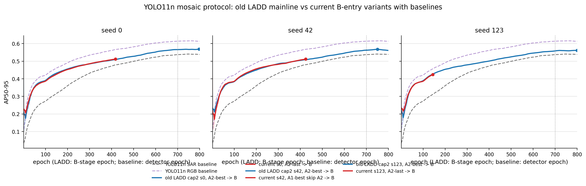
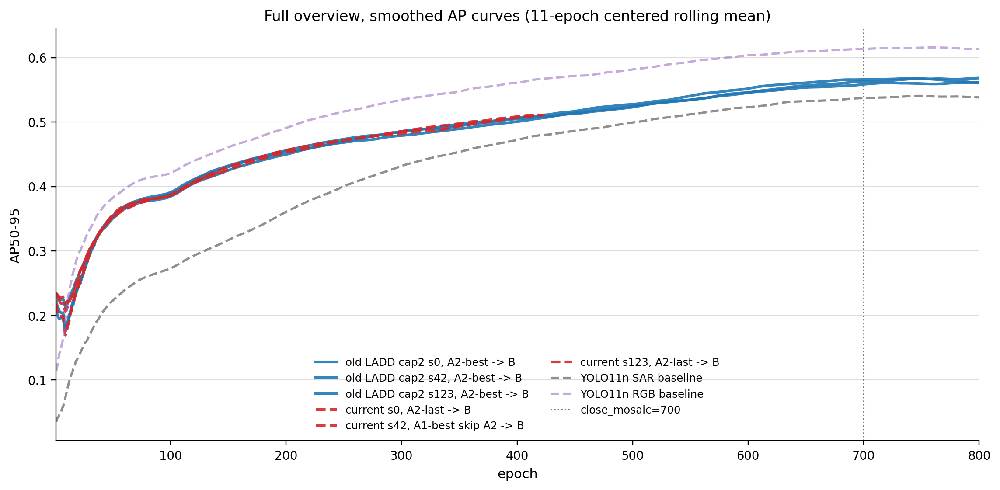
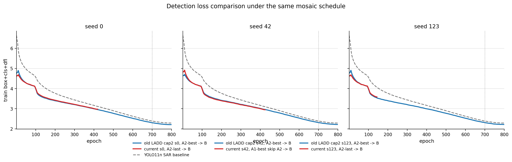
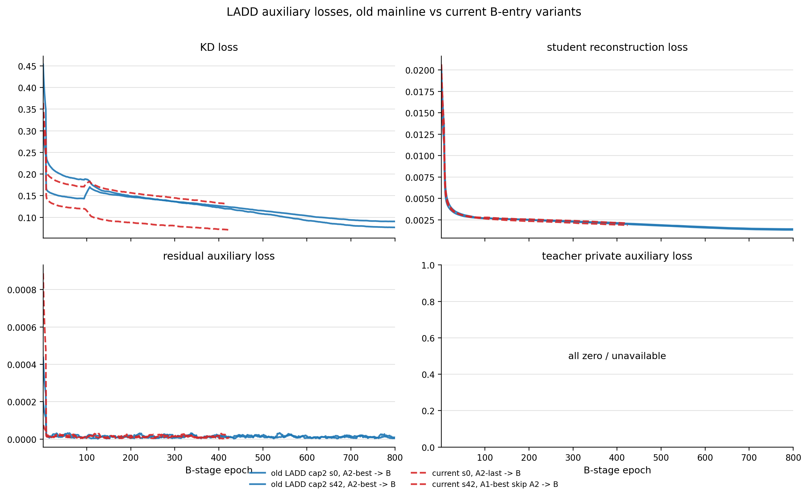
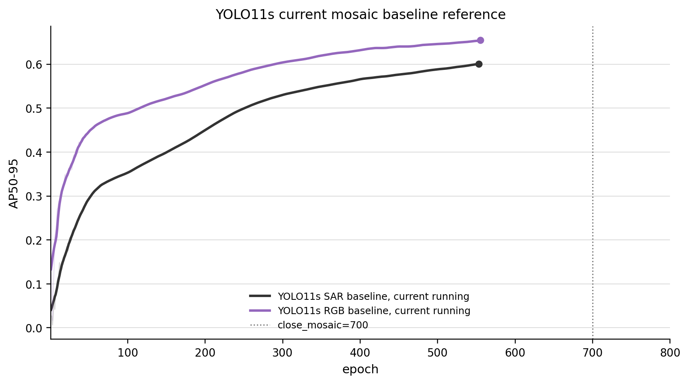

# LADD mosaic protocol curve comparison, 2026-06-15

协议匹配项：epochs=800, batch=64, imgsz=256, mosaic=1.0, close_mosaic=700, optimizer=auto, lr0=0.01, lrf=0.01, cos_lr=true, warmup_epochs=3.0, warmup_bias_lr=0.1。

注意：baseline 曲线是 detector 从头训练；LADD 曲线是 B 阶段训练。因此同图主要用于观察同一 mosaic/cosine 协议下的收敛形态，不应把横轴直接解释为相同训练阶段。

## Summary

| run_key        | group      |   seed | entry                 |   epochs_available |   best_ap50_95 |   best_epoch |   last_ap50_95 |
|:---------------|:-----------|-------:|:----------------------|-------------------:|---------------:|-------------:|---------------:|
| old_ladd_s0    | old_ladd   |      0 | A2 best               |                800 |        0.56841 |          798 |        0.56792 |
| old_ladd_s42   | old_ladd   |     42 | A2 best               |                800 |        0.56799 |          750 |        0.56044 |
| old_ladd_s123  | old_ladd   |    123 | A2 best               |                800 |        0.56163 |          800 |        0.56163 |
| new_ladd_s0    | new_ladd   |      0 | A2 last               |                419 |        0.51173 |          418 |        0.51166 |
| new_ladd_s42   | new_ladd   |     42 | A1 best, skip A2      |                424 |        0.51233 |          424 |        0.51233 |
| new_ladd_s123  | new_ladd   |    123 | A2 last               |                144 |        0.42414 |          144 |        0.42414 |
| baseline_n_sar | baseline   |    nan | detector from scratch |                800 |        0.54091 |          746 |        0.53836 |
| baseline_n_rgb | baseline   |    nan | detector from scratch |                800 |        0.6161  |          758 |        0.61345 |
| baseline_s_sar | baseline_s |    nan | detector from scratch |                556 |        0.60089 |          553 |        0.60072 |
| baseline_s_rgb | baseline_s |    nan | detector from scratch |                555 |        0.65442 |          555 |        0.65442 |

## Figures

