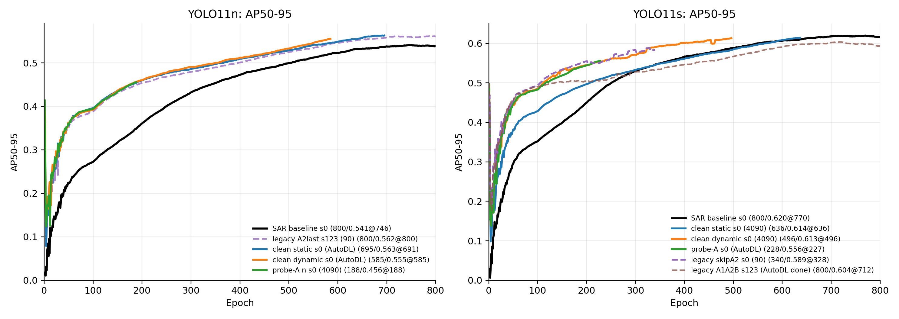
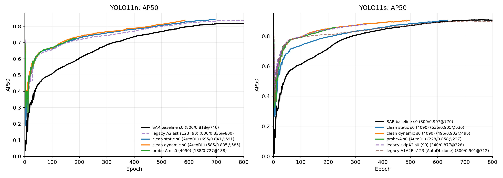
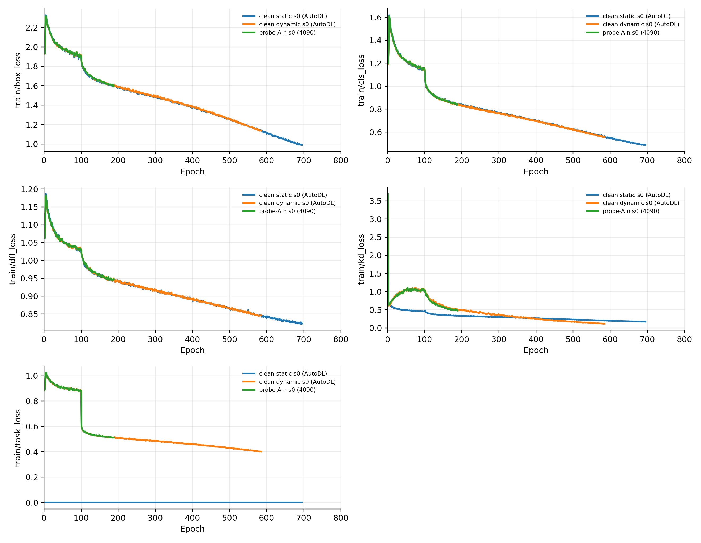
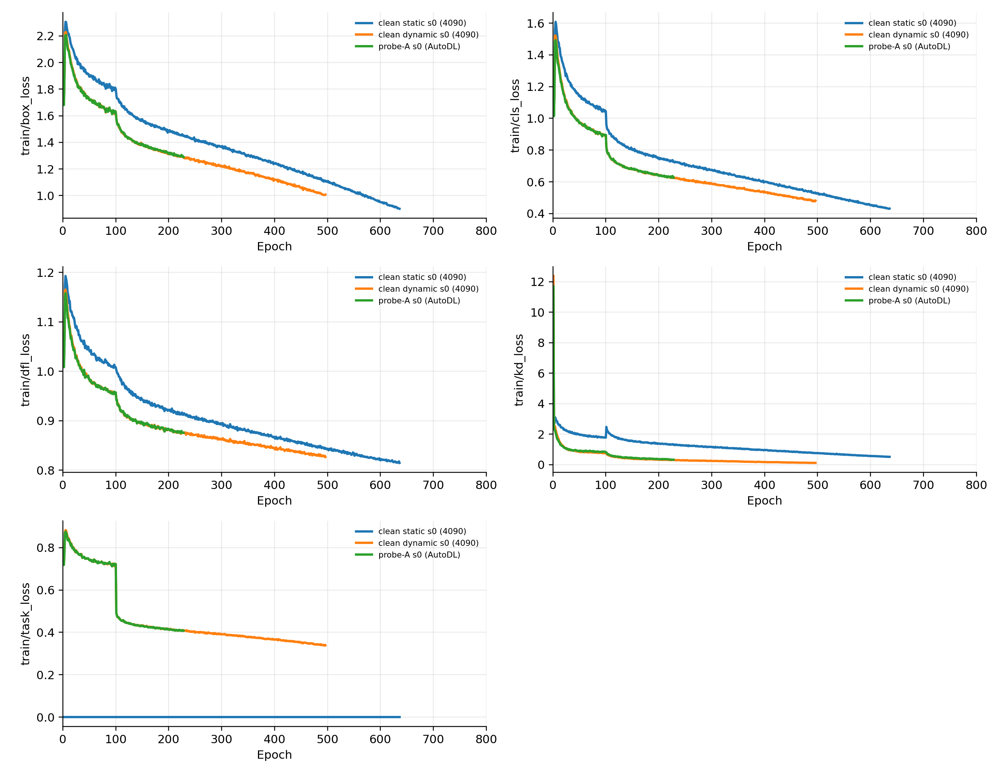

# LADD active progress snapshot

Time: 2026-06-17 18:43:10

## Summary

| model   | key                        | label                              | server   | kind          | active   |   rows |   last_epoch |   last_ap50 |   last_ap |   best_epoch |   best_ap50 |   best_ap | path                                                                                                                                                                                                                                                                                  |
|:--------|:---------------------------|:-----------------------------------|:---------|:--------------|:---------|-------:|-------------:|------------:|----------:|-------------:|------------:|----------:|:--------------------------------------------------------------------------------------------------------------------------------------------------------------------------------------------------------------------------------------------------------------------------------------|
| n       | n_baseline_sar             | SAR baseline s0                    | 90       | baseline      | False    |    800 |          800 |     0.81755 |   0.53836 |          746 |     0.81816 |   0.54091 | /mnt/dataY/ydf/projects/LADD_og/legacy_results_archive/pre_formal_nomosaic_20260528/runs_public/ogsod/hbb/baseline_controls/cos_closeAt100_E800_20260524/sar_yolo11n_hbb_800ep_cos_closeAt100_pat80_s0_gpu4/results.csv                                                               |
| n       | n_legacy_a2last_s123       | legacy A2last s123 (90)            | 90       | legacy        | False    |    800 |          800 |     0.83592 |   0.56163 |          800 |     0.83592 |   0.56163 | /mnt/dataY/ydf/projects/LADD_og/legacy_results_archive/pre_formal_nomosaic_20260528/runs_public/ogsod/hbb/ladd_converged_20260524/ladd_hbb_ogsod11n_ladd800r2_cap2_s123_b_e800_b64_s123_gpu5/results.csv                                                                              |
| n       | n_clean_static_autodl      | clean static s0 (AutoDL)           | autodl   | clean_static  | True     |    695 |          695 |     0.84088 |   0.56284 |          691 |     0.84087 |   0.56291 | /root/autodl-tmp/LADD_public/runs_public/ogsod/hbb/ladd_clean_a1b/mosaic_first100_close700/yolo11n/cap2/ladd_clean_a1b_ogsod11n_clean_a1b_yolo11n_cap2_s0_mosaic_first100_close700_autodl_p1_n_static_rebalanced_20260617_0110_autodl_b_e800_b64_s0_gpu0/results.csv                  |
| n       | n_clean_dynamic_autodl     | clean dynamic s0 (AutoDL)          | autodl   | clean_dynamic | True     |    585 |          585 |     0.835   |   0.55523 |          585 |     0.835   |   0.55523 | /root/autodl-tmp/LADD_public/runs_public/ogsod/hbb/ladd_clean_a1b_dynamic/mosaic_first100_close700/yolo11n/cap2/ladd_clean_a1b_dyn_ogsod11n_clean_a1b_dyn_yolo11n_cap2_s0_mosaic_first100_close700_autodl_p1_n_dynamic_rebalanced_20260617_0112_autodl_b_e800_b64_s0_gpu0/results.csv |
| n       | n_probe_4090               | probe-A n s0 (4090)                | 4090     | probe         | True     |    188 |          188 |     0.72697 |   0.4555  |          188 |     0.72697 |   0.4555  | /root/shared-nvme/LADD_public/runs_public/ogsod/hbb/ladd_clean_a1b_dynamic_probe/mosaic_first100_close700/yolo11n/cap2/ladd_clean_a1b_dynprobe_ogsod11n_clean_a1b_dynprobe_yolo11n_cap2_s0_mosaic_first100_close700_a_probe_4090_r1_20260617_1159_b_e800_b64_s0_gpu0/results.csv      |
| s       | s_baseline_sar             | SAR baseline s0                    | 90       | baseline      | False    |    800 |          800 |     0.90576 |   0.6157  |          770 |     0.90739 |   0.61972 | /mnt/dataY/ydf/projects/LADD_public/runs_public/ogsod/hbb/baseline_controls/mosaic_baselines_20260615/sar_yolo11s_hbb_mosaicE800_closeAt100_s0_gpu1_20260615/results.csv                                                                                                              |
| s       | s_clean_static_4090        | clean static s0 (4090)             | 4090     | clean_static  | True     |    636 |          636 |     0.90467 |   0.61404 |          636 |     0.90467 |   0.61404 | /root/shared-nvme/LADD_public/runs_public/ogsod/hbb/ladd_clean_a1b/mosaic_first100_close700/yolo11s/cap2/ladd_clean_a1b_ogsod11s_clean_a1b_yolo11s_cap2_s0_mosaic_first100_close700_4090_p0_s_static_rebalanced_20260617_0110_4090_b_e800_b64_s0_gpu0/results.csv                     |
| s       | s_clean_dynamic_4090       | clean dynamic s0 (4090)            | 4090     | clean_dynamic | True     |    496 |          496 |     0.90238 |   0.6131  |          496 |     0.90238 |   0.6131  | /root/shared-nvme/LADD_public/runs_public/ogsod/hbb/ladd_clean_a1b_dynamic/mosaic_first100_close700/yolo11s/cap2/ladd_clean_a1b_dyn_ogsod11s_clean_a1b_dyn_yolo11s_cap2_s0_mosaic_first100_close700_4090_p0_s_dynamic_rebalanced_20260617_0112_4090_b_e800_b64_s0_gpu0/results.csv    |
| s       | s_probe_autodl             | probe-A s0 (AutoDL)                | autodl   | probe         | True     |    228 |          228 |     0.85788 |   0.55578 |          227 |     0.85832 |   0.55583 | /root/autodl-tmp/LADD_public/runs_public/ogsod/hbb/ladd_clean_a1b_dynamic_probe/mosaic_first100_close700/yolo11s/cap2/ladd_clean_a1b_dynprobe_ogsod11s_clean_a1b_dynprobe_yolo11s_cap2_s0_mosaic_first100_close700_a_probe_autodl_r1_20260617_1159_b_e800_b64_s0_gpu0/results.csv     |
| s       | s_legacy_skipA2_90         | legacy skipA2 s0 (90)              | 90       | legacy        | True     |    340 |          340 |     0.87679 |   0.5838  |          328 |     0.877   |   0.58866 | /mnt/dataY/ydf/projects/LADD_public/runs_public/ogsod/hbb/ladd_mosaic_s_20260616/ladd_hbb_ogsod11s_mosaic_yolo11s_cap2_s0_mainline_A1B_skipA2_20260616_r1_from_a1best_b_e800_b64_s0_gpu1/results.csv                                                                                  |
| s       | s_legacy_a1a2b_s123_autodl | legacy A1A2B s123 (AutoDL done)    | autodl   | legacy_done   | False    |    800 |          800 |     0.897   |   0.59362 |          712 |     0.90066 |   0.60373 | /root/autodl-tmp/LADD_public/runs_public/ogsod/hbb/ladd_mosaic_s_20260616/ladd_hbb_ogsod11s_mosaic_yolo11s_cap2_s123_mainline_A1A2B_20260616_r2_autodl_b_e800_b64_s123_gpu0/results.csv                                                                                               |
| m       | m_baseline_sar_b64         | SAR baseline m b64 s0 (90 partial) | 90       | baseline      | False    |    793 |          793 |     0.92971 |   0.64251 |          713 |     0.9315  |   0.65092 | /mnt/dataY/ydf/projects/LADD_public/runs_public/ogsod/hbb/baseline_controls/mosaic_baselines_20260615/sar_yolo11m_hbb_mosaicE800_closeAt100_s0_gpu0_b64_restart_20260616_015135/results.csv                                                                                           |
| m       | m_baseline_rgb_b64         | RGB teacher m b64 s0 (90 partial)  | 90       | baseline_rgb  | False    |    680 |          680 |     0.94893 |   0.66845 |          600 |     0.95102 |   0.6734  | /mnt/dataY/ydf/projects/LADD_public/runs_public/ogsod/hbb/baseline_controls/mosaic_baselines_20260615/rgb_yolo11m_hbb_mosaicE800_closeAt100_s0_gpu0_b64_restart_20260616_015135/results.csv                                                                                           |

## Figures

